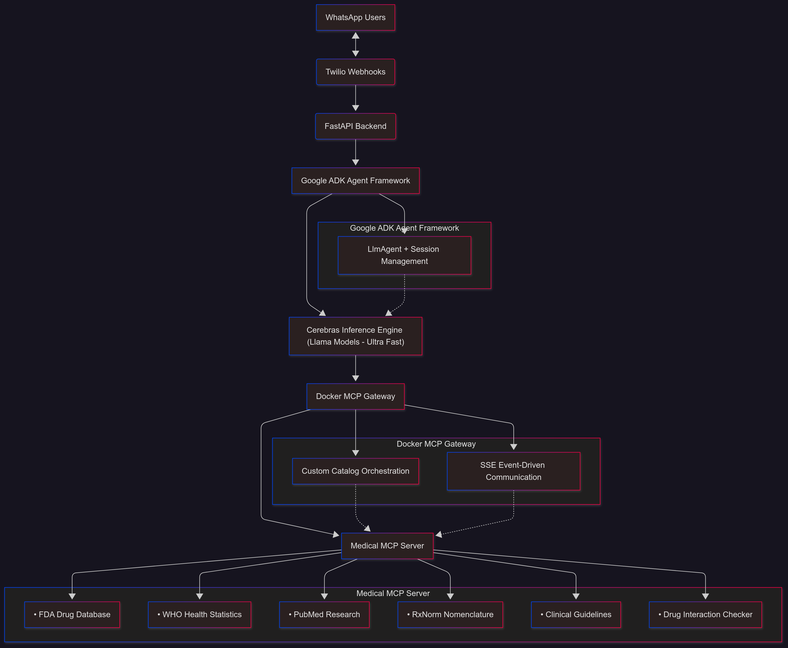

# 🏥 MediFitMate - Your AI-Powered Health Companion

<div align="center">

[](https://wa.me/)
[](https://www.docker.com/)
[](https://fastapi.tiangolo.com/)
[](https://cerebras.ai/)

**A revolutionary WhatsApp-based health assistant leveraging cutting-edge AI to democratize healthcare access**

[📺 Watch Demo](#-demo-videos) • [🚀 Features](#-key-features) • [🏗️ Architecture](#️-architecture) • [⚡ Quick Start](#-getting-started)

</div>

---

## 📺 Demo Videos

### 🎬 Project Presentation

**[▶️ Watch Full Presentation](https://www.youtube.com/watch?v=LFkyphRRj3w)**

### 🎯 Live Demo Walkthrough

**[▶️ Watch Working Demo](https://www.youtube.com/shorts/h1Qouoh6HPs)**

---

## 💡 Problem Statement

Healthcare accessibility remains a critical challenge globally:
- 📱 **Limited access** to medical information in rural/underserved areas
- 💊 **Prescription confusion** leading to medication errors
- 🍽️ **Nutritional guidance** often requires expensive consultations
- 🌍 **Language barriers** preventing effective healthcare communication
- 📊 **Fragmented health tracking** across multiple apps and platforms

## 🎯 Our Solution

MediFitMate brings **AI-powered healthcare assistance** directly to users' most-used platform - **WhatsApp**. No app downloads, no complex interfaces, just intelligent health support through familiar chat.

---

## ✨ Key Features

### 🔬 Medical Intelligence
- **💊 Prescription Analysis**: Upload prescription images and receive detailed explanations of medications, dosages, and timing
- **🧬 Drug Interaction Checking**: Real-time validation against potential drug interactions
- **📚 Medical Literature Search**: Access to PubMed, FDA, WHO databases for evidence-based information
- **🔍 Drug Nomenclature**: Search and understand medications using RxNorm standards

### 🥗 Nutrition & Wellness
- **📸 Meal Understanding**: Analyze food images to understand nutritional content
- **🎯 Personalized Recommendations**: AI-driven meal suggestions based on health profiles
- **💧 Hydration Tracking**: Smart reminders and intake monitoring
- **🧘 Yoga & Fitness**: Guided sessions tailored to user fitness levels

### 🌐 Accessibility Features
- **🗣️ Multi-language Support**: Break down language barriers in healthcare
- **📱 WhatsApp Native**: Works on any device, no app installation required
- **♿ Inclusive Design**: Accessible to users of all technical literacy levels

---

## 🏗️ Architecture

### System Design Overview



### 🔧 Technology Stack

| Layer | Technology | Purpose |
|-------|-----------|---------|
| **Frontend** | WhatsApp + Twilio API | User interface & messaging |
| **Backend** | FastAPI | High-performance async web framework |
| **AI Framework** | Google ADK | Agent orchestration & session management |
| **LLM Inference** | Cerebras + Llama Models | Lightning-fast AI responses |
| **Tool Integration** | Docker MCP Gateway | Microservice orchestration |
| **Medical Data** | Custom MCP Server | Specialized medical tool suite |
| **Containerization** | Docker + Docker Compose | Deployment & scaling |

---

## 🚀 Technical Highlights

### ⚡ Cerebras-Powered Lightning Speed
- Leverages Cerebras' wafer-scale engine for **sub-second inference**
- Handles complex medical queries with **10x faster** response times
- Optimized model loading with async lifespan management

### 🔌 Modular MCP Architecture
- **Custom catalog system** for dynamic tool registration
- **SSE-based transport** for real-time event streaming
- **Inter-container communication** via Docker bridge networks
- **Healthcheck integration** ensuring service reliability

### 🧠 Google ADK Intelligence
- **MCPToolset abstraction** for seamless medical tool access
- **InMemorySessionService** for stateful conversations
- **Asynchronous runner** for non-blocking responses
- **Context-aware dialogue** management across sessions

### 🔒 Enterprise-Grade Design
- Modern FastAPI **lifespan events** for clean resource management
- Graceful startup/shutdown with connection pooling
- Environment-based configuration for security
- Webhook validation and rate limiting

---

## 📦 MCP Gateway Configuration

Our custom Medical MCP catalog provides 10+ specialized tools:

```yaml
tools:
  - search-drugs              # Search FDA drug databases
  - get-drug-details          # Detailed medication information
  - get-health-statistics     # WHO health data
  - get-article-details       # PubMed research articles
  - search-drug-nomenclature  # RxNorm standard names
  - search-google-scholar     # Academic research
  - search-clinical-guidelines # Evidence-based protocols
  - check-drug-interactions   # Safety validation
  - search-medical-databases  # Comprehensive medical search
  - search-medical-journals   # Latest medical publications
```

**Transport**: Server-Sent Events (SSE) for efficient real-time communication  
**Endpoint**: `http://medical-mcp:8000/sse`  
**Timeout**: 30s with retry logic  
**Environment**: Development-optimized with comprehensive logging

---

## 🏁 Getting Started

### Prerequisites

```bash
- Docker 20.10+
- Docker Compose 2.0+
- Node.js 18+ (for MCP server)
- Python 3.11+
```

### Quick Setup

1. **Clone the repository**
   ```bash
   git clone https://github.com/ganaaduvva/medifitmate.git
   cd medifitmate
   ```

2. **Configure environment variables**
   ```bash
   cp .env.example .env
   # Edit .env with your credentials:
   # - MCP_GATEWAY_URL
   # - CEREBRAS_API_KEY
   # - TWILIO_ACCOUNT_SID
   # - TWILIO_AUTH_TOKEN
   # - TWILIO_WHATSAPP_NUMBER
   ```

3. **Launch the stack**
   ```bash
   docker-compose up --build
   ```

4. **Configure Twilio webhook**
   - Set incoming message webhook to: `https://your-domain/webhook/whatsapp`
   - Enable status callbacks for delivery tracking

5. **Start chatting!**
   - Send a WhatsApp message to your configured Twilio number
   - Try: "Can you explain my prescription?" with an image attachment

---

## 📊 Impact & Use Cases

### 🎯 Target Users
- **Patients** managing chronic conditions
- **Caregivers** supporting elderly family members
- **Health-conscious individuals** tracking fitness goals
- **Rural communities** with limited healthcare access
- **Non-native speakers** needing multilingual support

### 💪 Real-World Impact
- ✅ Reduce medication errors through clear prescription explanations
- ✅ Improve medication adherence with personalized reminders
- ✅ Democratize nutritional guidance for better health outcomes
- ✅ Bridge language gaps in healthcare communication
- ✅ Provide 24/7 access to evidence-based medical information

---

## 🛣️ Roadmap

- [ ] **Voice message support** for hands-free interaction
- [ ] **Images support** for hospital prescription analysis
- [ ] **Multi-platform expansion** (Telegram, Messenger, etc.)

---

## 🏆 Why MediFitMate Stands Out

1. **🚀 Technical Excellence**: Cutting-edge integration of Cerebras, MCP architecture, and Google ADK
2. **🌍 Real Impact**: Addresses genuine healthcare accessibility challenges
3. **📱 User-First**: Builds on familiar WhatsApp interface - no learning curve
4. **🔧 Scalable**: Containerized microservice architecture ready for growth
5. **🔒 Responsible AI**: Evidence-based responses from trusted medical databases
6. **♿ Inclusive**: Multi-language support and accessibility-first design

---

## 👥 Team

Built with ❤️ by passionate developers committed to democratizing healthcare through technology.


### Meet the Team

  <table>
    <tr>
      <td align="center" width="25%">
        <br />
        <sub><b>Sanjana Gunda</b></sub><br />
        <a href="https://github.com/sanjana990">GitHub</a> 
      </td>
      <td align="center" width="25%">
        <br />
        <sub><b>MD Khalid</b></sub><br />
        <a href="https://github.com/Khalid2703">GitHub</a>
      </td>
    </tr>
  </table>


**🤝 We're always open to collaboration and feedback!**

---

## 📄 License

This project is licensed under the MIT License.

---

## 🙏 Acknowledgments

- **Cerebras** for providing ultra-fast inference capabilities
- **Google ADK** for the powerful agent framework
- **Docker MCP** for the flexible gateway architecture
- **Medical databases**: FDA, WHO, PubMed, RxNorm
- **Twilio** for reliable WhatsApp messaging infrastructure

---

<div align="center">

**Made for FutureStack Hackathon 2025**

⭐ Star this repo if you believe in accessible healthcare for all!

[Report Bug](https://github.com/ganaaduvva/medifitmate/issues) • [Request Feature](https://github.com/ganaaduvva/medifitmate/issues)

</div>
